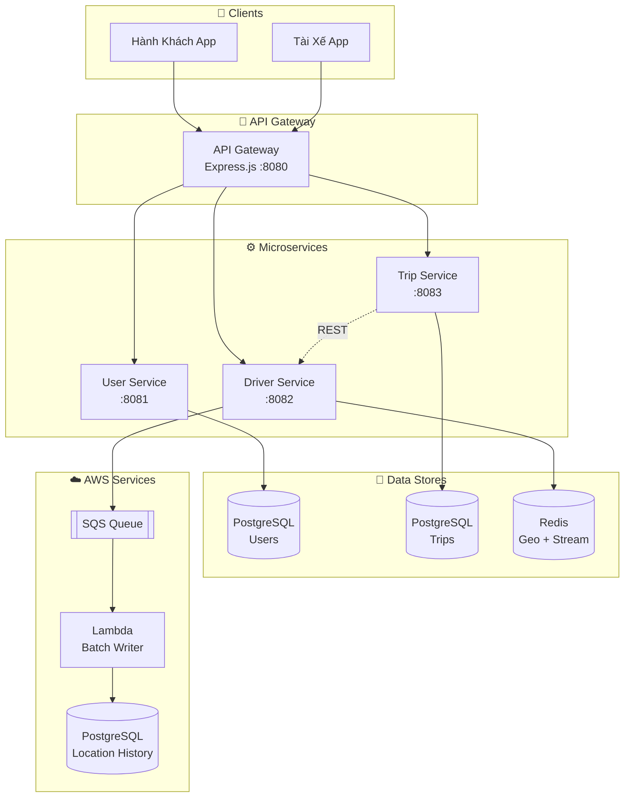

# 🚖 UIT-Go – Cloud-Native Ride Hailing Platform

UIT-Go là đồ án mô phỏng hệ thống gọi xe (Grab/Uber) được thiết kế theo kiến trúc **microservices** gồm:

- 🧍 **UserService** — Quản lý người dùng (đăng ký, đăng nhập, profile)
- 🚕 **TripService** — Xử lý chuyến đi (đặt xe, hủy, hoàn thành, đánh giá)
- 🚗 **DriverService** — Quản lý tài xế, vị trí thời gian thực, và phản hồi chuyến
- 🗺 **Redis** — Lưu toạ độ geospatial của tài xế
- 🗄 **PostgreSQL** — CSDL riêng cho từng service

---
## 🗺 Bản đồ tài liệu (Documentation Map)
- Backend:
    - [Xem chi tiết các Microservices](services/README.md): Cấu trúc code của Driver, Trip, User service.
- DevOps:
    - [Cấu hình Hạ tầng AWS](infra/terraform/README.md): Hướng dẫn Terraform, LocalStack, AWS SQS.
    - [Docker Setup](docker/README.md): Chi tiết về Docker Compose và Environment Variables.
- Architects:
    - [Quyết định kiến trúc ADR](ADR/README.md): Tại sao chúng tôi chọn công nghệ này.
---

## 🏗️ Kiến Trúc Hệ Thống



📚 **Xem chi tiết các luồng dữ liệu:** [docs/DATAFLOW.md](docs/DATAFLOW.md)

---

## 📁 1. Cấu trúc thư mục

```
UIT-GO/
│
├── ADR/                          # Architecture Decision Record – ghi lại các quyết định thiết kế hệ thống
│
├── docker/
│   ├── env/                      # Chứa các file .env cho từng service chạy bằng Docker
│   ├── docker-compose.loadtest.yml  # File docker-compose dùng riêng cho load test
│   ├── docker-compose.yml        # File docker-compose chính để chạy toàn hệ thống
│   └── README.md                 # Hướng dẫn sử dụng Docker
│
├── docs/                         # Tài liệu mô tả hệ thống, API, kiến trúc, biểu đồ…
│
├── infra/
│   ├── localstack/               # Môi trường local giả lập AWS (S3, SQS, Lambda...)
│   └── terraform/                # Hạ tầng AWS provisioning bằng Terraform
│
├── scripts/                      # Các script hỗ trợ (deploy, migrate database, init)
│
├── services/                     # Thư mục chứa toàn bộ microservices
│   │
│   ├── api-gateway/
│   │   ├── src/                  # Mã nguồn API Gateway (routing, auth, rate limit...)
│   │   ├── Dockerfile            # Cấu hình Docker cho API Gateway
│   │   └── package.json          # Thông tin dependencies & scripts
│   │
│   ├── driver-service/
│   │   ├── load-tests/           # Bộ kịch bản giúp kiểm thử tải cho driver-service
│   │   ├── src/                  # Mã nguồn backend của Driver Service
│   │   ├── tests/                # Unit test / integration test
│   │   ├── Dockerfile            # Docker build cho Driver Service
│   │   └── package.json
│   │
│   ├── trip-service/
│   │   ├── src/                  # Mã nguồn xử lý logic chuyến đi (Trip)
│   │   ├── Dockerfile
│   │   └── package.json
│   │
│   └── user-service/
│       ├── src/                  # Mã nguồn xử lý logic người dùng (User)
│       ├── Dockerfile            # Docker build cho user-service
│       └── package.json          
│
├── .gitignore                    # File bỏ qua khi commit git
│
└── README.md                     # Mô tả chung toàn dự án
```
---

## ⚙️ 2. Chạy toàn bộ hệ thống bằng Docker Compose

1. **Clone repo và vào thư mục docker**

```bash
git clone https://github.com/ThinhDangQuoc/UIT-Go-Cloud-Native-Ride-Hailing-Platform
cd docker
```

2. **Tạo các file môi trường (copy từ template)**

```bash
cp env/example.user-service.env env/user-service.env
cp env/example.driver-service.env env/driver-service.env
cp env/example.trip-service.env env/trip-service.env
cp env/example.api-gateway.env env/api-gateway.env
```
→ Sau đó chỉnh sửa các biến như DB password, JWT secret, v.v.

3. **Build và khởi động toàn bộ hệ thống**

```bash
docker compose up --build
```

Hoặc chạy ở chế độ detached:
```bash
docker compose up --build
```

Docker sẽ tự động:
- Tạo 3 container PostgreSQL (user-db, trip-db, driver-db)
- Khởi chạy Redis (driver-redis)
- Build & chạy 3 service Node.js:
  - `user-service` → http://localhost:8081
  - `driver-service` → http://localhost:8082
  - `trip-service` → http://localhost:8083


4. **Kiểm tra trạng thái**
```bash
docker compose ps
docker compose logs -f api-gateway
```

Khi thấy log:

```
✅ [user-service] users table ready
🚕 TripService running on port 8083
🚗 DriverService running on port 8082
✅ Redis connection ready
```

→ hệ thống đã sẵn sàng.

---

## 🧰 3. Stack sử dụng

| Thành phần | Công nghệ | Mục đích
|-------------|------------| ---------------- |
| Runtime | Node.js | Môi trường chạy Javascript |
| Framework | Express.js | Xây dựng RESTful API |
| Database | PostgreSQL | Lưu trữ dữ liệu |
| Cache / GeoIndex | Redis | Caching & Geo-spatial index (tìm xe gần nhất) |
| Authentication | JWT | Xác thực người dùng |
| Infra | Docker + Docker Compose | Containerization & Orchestration |
| Communication | REST (Axios) | Giao tiếp giữa các service |
| Realtime | Socket.IO (DriverService) | Cập nhật vị trí tài xế & thông báo chuyến đi |
| Message Queue | AWS SQS | Xử lý bất đồng bộ giữa TripService và DriverService |
| Cloud Sim | LocalStack | Giả lập môi trường AWS SQS dưới local |

---

## 📊 4. Load Testing

### 9.1 Cài đặt K6

```bash
# Windows (Chocolatey)
choco install k6

# macOS
brew install k6

# Linux
sudo apt install k6
```

### 9.2 Chạy Load Tests

```bash
cd modules/driver-service/load-tests

# Smoke Test (kiểm tra cơ bản)
k6 run 01-smoke-test.js

# Load Test (đo throughput)
k6 run 02-load-test.js

# Stress Test (tìm breaking point)
k6 run 03-stress-test.js

# Spike Test (kiểm tra đột biến)
k6 run 04-spike-test.js

# Soak Test (kiểm tra ổn định dài hạn)
k6 run 05-soak-test.js

# Capacity Test (xác định max capacity)
k6 run 06-capacity-test.js
```

### 9.3 Kết quả Load Test

| Test | Throughput | Success Rate | P95 Latency |
|------|------------|--------------|-------------|
| Smoke | 16 req/s | 100% | 9ms |
| Load | **452 req/s** | 99.98% | 327ms |
| Stress | 473 req/s | 87.34% | 29,999ms |
| Soak | 487 req/s | **100%** | 480ms |

Chi tiết: xem `modules/driver-service/load-tests/LOAD-TEST-REPORT.md`

---

## 📚 5. Tài liệu

| File | Mô tả |
|------|-------|
| `docs/ARCHITECTURE.md` | Kiến trúc hệ thống tổng quan |
| `docs/REPORT.md` | Báo cáo Module chuyên sâu |
| `ADR/` | Thư mục chứa Architectural Decision Records |
| `ADR/1-decide-microservices-architecture.md` | ADR: Microservices Architecture |
| `ADR/2-decide-redis-for-driver-location.md` | ADR: Redis cho vị trí tài xế |
| `ADR/3-decide-rest-over-grpc.md` | ADR: REST thay vì gRPC |
| `ADR/4-driver-location-streaming-architecture.md` | ADR: Event Streaming với SQS |
| `terraform/API_GATEWAY_SQS_GUIDE.md` | Hướng dẫn API Gateway + SQS |
| `modules/driver-service/load-tests/LOAD-TEST-REPORT.md` | Kết quả Load Testing chi tiết |

---

✨ **UIT-Go - Cloud-Native Ride Hailing Platform**

Được phát triển cho môn học SE360 - Điện toán đám mây @ UIT
