# 📊 Dataflow Diagrams - UIT-Go

Tài liệu này mô tả chi tiết các luồng dữ liệu trong hệ thống UIT-Go sử dụng Mermaid sequence diagrams.

---

## 📋 Mục Lục

1. [Tổng Quan Hệ Thống](#1-tổng-quan-hệ-thống)
2. [Luồng A: Đăng Ký & Xác Thực](#2-luồng-a-đăng-ký--xác-thực)
3. [Luồng B: Tài Xế Cập Nhật Vị Trí](#3-luồng-b-tài-xế-cập-nhật-vị-trí)
4. [Luồng C: Hành Khách Đặt Xe](#4-luồng-c-hành-khách-đặt-xe)
5. [Luồng D: Tài Xế Phản Hồi Chuyến](#5-luồng-d-tài-xế-phản-hồi-chuyến)
6. [Luồng E: Hoàn Thành & Đánh Giá](#6-luồng-e-hoàn-thành--đánh-giá)

---

## 1. Tổng Quan Hệ Thống

```mermaid
flowchart TB
    subgraph Clients ["📱 Clients"]
        PA[Hành Khách App]
        DA[Tài Xế App]
    end

    subgraph Gateway ["🚪 API Gateway"]
        AG[API Gateway<br/>Express.js :8080]
    end

    subgraph Services ["⚙️ Microservices"]
        US[User Service<br/>:8081]
        DS[Driver Service<br/>:8082]
        TS[Trip Service<br/>:8083]
    end

    subgraph DataStores ["💾 Data Stores"]
        PG_USER[(PostgreSQL<br/>Users)]
        PG_TRIP[(PostgreSQL<br/>Trips)]
        REDIS[(Redis<br/>Geo + Stream)]
    end

    subgraph AWS ["☁️ AWS Services"]
        SQS[[SQS Queue]]
        LAMBDA[Lambda<br/>Batch Writer]
        PG_HIST[(PostgreSQL<br/>Location History)]
    end

    PA --> AG
    DA --> AG
    AG --> US
    AG --> DS
    AG --> TS

    US --> PG_USER
    DS --> REDIS
    DS --> SQS
    TS --> PG_TRIP
    TS -.->|REST| DS

    SQS --> LAMBDA
    LAMBDA --> PG_HIST
```

---

## 2. Luồng A: Đăng Ký & Xác Thực

### 2.1. Đăng Ký Tài Khoản Mới

```mermaid
sequenceDiagram
    autonumber
    participant C as 📱 Client<br/>(Hành Khách/Tài Xế)
    participant AG as 🚪 API Gateway
    participant US as 👤 User Service
    participant DB as 💾 PostgreSQL

    C->>AG: POST /api/users<br/>{email, password, role, personal_info}
    AG->>US: Forward request
    
    US->>DB: SELECT * FROM users WHERE email = ?
    
    alt Email đã tồn tại
        DB-->>US: User exists
        US-->>AG: 400 Bad Request
        AG-->>C: ❌ "Email đã được sử dụng"
    else Email chưa tồn tại
        US->>US: Hash password (bcrypt)
        US->>DB: INSERT INTO users (email, password_hash, role, ...)
        DB-->>US: User created (id: 123)
        US-->>AG: 201 Created
        AG-->>C: ✅ {id: 123, email, role}
    end
```

### 2.2. Đăng Nhập & Nhận JWT

```mermaid
sequenceDiagram
    autonumber
    participant C as 📱 Client
    participant AG as 🚪 API Gateway
    participant US as 👤 User Service
    participant DB as 💾 PostgreSQL

    C->>AG: POST /api/sessions<br/>{email, password}
    AG->>US: Forward request
    
    US->>DB: SELECT * FROM users WHERE email = ?
    DB-->>US: User data (password_hash)
    
    US->>US: bcrypt.compare(password, password_hash)
    
    alt Mật khẩu không đúng
        US-->>AG: 401 Unauthorized
        AG-->>C: ❌ "Sai email hoặc mật khẩu"
    else Mật khẩu đúng
        US->>US: jwt.sign({userId, role}, SECRET, {expiresIn: '24h'})
        US-->>AG: 200 OK
        AG-->>C: ✅ {token: "eyJhbGc...", user: {...}}
    end

    Note over C: Token được lưu và gửi kèm<br/>trong header Authorization<br/>cho mọi request tiếp theo
```

### 2.3. Xác Thực Token (Middleware)

```mermaid
sequenceDiagram
    autonumber
    participant C as 📱 Client
    participant AG as 🚪 API Gateway
    participant MW as 🔒 Auth Middleware
    participant SVC as ⚙️ Any Service

    C->>AG: GET /api/protected-route<br/>Header: Authorization: Bearer {token}
    AG->>MW: Verify JWT
    
    MW->>MW: jwt.verify(token, SECRET)
    
    alt Token không hợp lệ/hết hạn
        MW-->>AG: 401 Unauthorized
        AG-->>C: ❌ "Token không hợp lệ"
    else Token hợp lệ
        MW->>MW: Decode payload {userId, role}
        MW->>SVC: Forward request + req.user
        SVC-->>AG: Response data
        AG-->>C: ✅ Protected data
    end
```

---

## 3. Luồng B: Tài Xế Cập Nhật Vị Trí

### 3.1. Tài Xế Bật Online

```mermaid
sequenceDiagram
    autonumber
    participant D as 🚗 Tài Xế App
    participant AG as 🚪 API Gateway
    participant DS as 🛣️ Driver Service
    participant REDIS as 💾 Redis
    participant DB as 💾 PostgreSQL

    D->>AG: PUT /api/drivers/:id/status<br/>{status: "online"}
    AG->>DS: Forward request
    
    DS->>REDIS: SET driver:status:{id} "online"
    DS->>DB: UPDATE drivers SET status = 'online' WHERE id = ?
    
    DB-->>DS: Updated
    DS-->>AG: 200 OK
    AG-->>D: ✅ {status: "online", message: "Bạn đã online"}

    Note over D: App bắt đầu gửi<br/>vị trí mỗi 2-3 giây
```

### 3.2. Cập Nhật Vị Trí Real-time (Dual-Path)

```mermaid
sequenceDiagram
    autonumber
    participant D as 🚗 Tài Xế App
    participant AG as 🚪 API Gateway
    participant DS as 🛣️ Driver Service
    participant REDIS as 💾 Redis<br/>(Geo + Stream)
    participant SQS as 📨 AWS SQS
    participant LAMBDA as ⚡ Lambda
    participant PG as 💾 PostgreSQL<br/>(History)

    loop Mỗi 2-3 giây (khi có chuyến)<br/>hoặc 10-15 giây (idle)
        D->>AG: PUT /api/drivers/:id/location<br/>{lat, lng, heading, speed, tripId?}
        AG->>DS: Forward request
        
        par Path 1: Real-time (Đồng bộ)
            DS->>REDIS: GEOADD drivers:locations lng lat driverId
            DS->>REDIS: HSET driver:location:{id}<br/>{lat, lng, heading, speed, updatedAt}
            DS->>REDIS: XADD stream:driver:locations *<br/>{driverId, lat, lng, timestamp}
            REDIS-->>DS: OK
        and Path 2: History (Bất đồng bộ)
            DS->>SQS: SendMessage<br/>{driverId, lat, lng, timestamp, tripId}
            SQS-->>DS: MessageId
        end
        
        DS-->>AG: 200 OK
        AG-->>D: ✅ {success: true}
    end

    Note over SQS,PG: Batch Processing (mỗi 30 giây)
    
    SQS->>LAMBDA: Trigger (batch 100 messages)
    LAMBDA->>LAMBDA: Parse & validate messages
    LAMBDA->>PG: INSERT INTO driver_location_history<br/>(driver_id, lat, lng, trip_id, recorded_at)<br/>VALUES (...), (...), ...
    PG-->>LAMBDA: Inserted
    LAMBDA-->>SQS: Delete processed messages
```

### 3.3. Chi Tiết Redis Data Structures

```mermaid
flowchart LR
    subgraph REDIS ["💾 Redis Data Structures"]
        subgraph GEO ["GeoSet: drivers:locations"]
            G1["driver_1: (106.6297, 10.8231)"]
            G2["driver_2: (106.6350, 10.8150)"]
            G3["driver_3: (106.6400, 10.8300)"]
        end
        
        subgraph HASH ["Hash: driver:location:{id}"]
            H1["lat: 10.8231"]
            H2["lng: 106.6297"]
            H3["heading: 45"]
            H4["speed: 30"]
            H5["updatedAt: 1732800000"]
        end
        
        subgraph STREAM ["Stream: stream:driver:locations"]
            S1["1732800000-0: {driver_1, 10.8231, 106.6297}"]
            S2["1732800003-0: {driver_2, 10.8150, 106.6350}"]
        end
        
        subgraph STATUS ["String: driver:status:{id}"]
            ST1["online | offline | on_trip"]
        end
    end
```

---

## 4. Luồng C: Hành Khách Đặt Xe

### 4.1. Tạo Chuyến Đi Mới

```mermaid
sequenceDiagram
    autonumber
    participant P as 👤 Hành Khách App
    participant AG as 🚪 API Gateway
    participant TS as 🚕 Trip Service
    participant DS as 🛣️ Driver Service
    participant REDIS as 💾 Redis
    participant DB as 💾 PostgreSQL

    P->>AG: POST /api/trips<br/>{pickup, destination, fare}<br/>Header: Authorization: Bearer {token}
    AG->>TS: Forward request

    TS->>DB: INSERT INTO trips<br/>(passenger_id, pickup, destination, fare, status='searching')
    DB-->>TS: Trip created (id: 456)

    TS->>DS: GET /drivers/search?lat=10.82&lng=106.63&radius=5km
    
    DS->>REDIS: GEORADIUS drivers:locations<br/>106.63 10.82 5 km WITHDIST ASC COUNT 10
    REDIS-->>DS: [{driver_1, 0.5km}, {driver_3, 1.2km}, ...]
    
    DS->>REDIS: MGET driver:status:driver_1 driver:status:driver_3 ...
    REDIS-->>DS: ["online", "on_trip", ...]
    
    DS-->>TS: Danh sách tài xế online gần nhất<br/>[{id: driver_1, distance: 0.5km, status: online}]

    Note over TS: Chọn tài xế gần nhất<br/>đang online

    TS->>DS: POST /drivers/driver_1/notify<br/>{tripId: 456, pickup, destination, fare}
    DS-->>TS: Notification sent
    
    TS->>DB: UPDATE trips SET status='pending_driver' WHERE id=456
    TS-->>AG: 201 Created
    AG-->>P: ✅ {tripId: 456, status: 'pending_driver',<br/>driver: {id, name, distance}, timeout: 15s}

    Note over P: Hiển thị màn hình chờ<br/>tài xế phản hồi (15 giây)
```

### 4.2. Tìm Tài Xế Gần Nhất (Chi Tiết)

```mermaid
sequenceDiagram
    autonumber
    participant TS as 🚕 Trip Service
    participant DS as 🛣️ Driver Service
    participant REDIS as 💾 Redis

    TS->>DS: GET /drivers/search<br/>?lat=10.82&lng=106.63&radius=5

    DS->>REDIS: GEORADIUS drivers:locations<br/>106.63 10.82 5 km<br/>WITHDIST WITHCOORD ASC COUNT 20
    
    Note over REDIS: Trả về tài xế trong bán kính 5km<br/>sắp xếp theo khoảng cách tăng dần

    REDIS-->>DS: [<br/>  {member: "driver_1", dist: 0.5, coord: [106.63, 10.82]},<br/>  {member: "driver_3", dist: 1.2, coord: [106.64, 10.83]},<br/>  {member: "driver_7", dist: 2.8, coord: [106.65, 10.84]}<br/>]

    loop Với mỗi tài xế tìm được
        DS->>REDIS: HGETALL driver:location:{driverId}
        REDIS-->>DS: {lat, lng, heading, speed, updatedAt}
        
        DS->>REDIS: GET driver:status:{driverId}
        REDIS-->>DS: "online" | "on_trip" | "offline"
        
        DS->>DS: Lọc: chỉ giữ tài xế "online"<br/>và updatedAt < 30 giây
    end

    DS-->>TS: Filtered drivers:<br/>[{id: "driver_1", distance: 0.5, eta: "2 phút"}]
```

---

## 5. Luồng D: Tài Xế Phản Hồi Chuyến

### 5.1. Tài Xế Nhận Chuyến (Accept)

```mermaid
sequenceDiagram
    autonumber
    participant D as 🚗 Tài Xế App
    participant AG as 🚪 API Gateway
    participant DS as 🛣️ Driver Service
    participant TS as 🚕 Trip Service
    participant REDIS as 💾 Redis
    participant DB as 💾 PostgreSQL
    participant P as 👤 Hành Khách App

    Note over D: Nhận thông báo chuyến mới<br/>Hiển thị: pickup, destination, fare

    D->>AG: POST /api/drivers/:id/trips/:tripId/accept
    AG->>DS: Forward request

    DS->>REDIS: GET driver:status:{driverId}
    REDIS-->>DS: "online"
    
    alt Tài xế không online
        DS-->>AG: 400 Bad Request
        AG-->>D: ❌ "Bạn cần bật online để nhận chuyến"
    else Tài xế đang online
        DS->>TS: PUT /trips/:tripId/accept<br/>{driverId}
        
        TS->>DB: SELECT status FROM trips WHERE id = ?
        DB-->>TS: status = 'pending_driver'
        
        alt Chuyến đã bị hủy hoặc có tài xế khác
            TS-->>DS: 409 Conflict
            DS-->>AG: 409 Conflict
            AG-->>D: ❌ "Chuyến đi không còn khả dụng"
        else Chuyến còn khả dụng
            TS->>DB: UPDATE trips<br/>SET driver_id = ?, status = 'accepted'<br/>WHERE id = ? AND status = 'pending_driver'
            DB-->>TS: Updated (1 row)
            
            DS->>REDIS: SET driver:status:{driverId} "on_trip"
            REDIS-->>DS: OK
            
            TS-->>DS: 200 OK {trip details}
            DS-->>AG: 200 OK
            AG-->>D: ✅ {tripId, passenger, pickup, destination}
            
            Note over TS,P: Notify hành khách
            TS-->>P: 🔔 Push Notification<br/>"Tài xế đã nhận chuyến"
        end
    end
```

### 5.2. Tài Xế Từ Chối Chuyến (Reject)

```mermaid
sequenceDiagram
    autonumber
    participant D as 🚗 Tài Xế App
    participant AG as 🚪 API Gateway
    participant DS as 🛣️ Driver Service
    participant TS as 🚕 Trip Service
    participant REDIS as 💾 Redis
    participant DB as 💾 PostgreSQL

    D->>AG: POST /api/drivers/:id/trips/:tripId/reject<br/>{reason: "Quá xa"}
    AG->>DS: Forward request

    DS->>TS: PUT /trips/:tripId/reject<br/>{driverId, reason}
    
    TS->>DB: INSERT INTO trip_rejections<br/>(trip_id, driver_id, reason, rejected_at)
    DB-->>TS: Logged
    
    Note over TS: Tìm tài xế tiếp theo trong danh sách

    TS->>DS: GET /drivers/search?lat=...&lng=...&exclude=driver_1
    DS->>REDIS: GEORADIUS ... (exclude rejected driver)
    REDIS-->>DS: [{driver_3, 1.2km}]
    DS-->>TS: Next driver: driver_3

    alt Còn tài xế khả dụng
        TS->>DS: POST /drivers/driver_3/notify<br/>{tripId, pickup, destination}
        DS-->>TS: Notified
        TS-->>DS: 200 OK
        DS-->>AG: 200 OK
        AG-->>D: ✅ "Đã từ chối chuyến"
    else Không còn tài xế
        TS->>DB: UPDATE trips SET status='no_driver' WHERE id=?
        TS-->>DS: 200 OK
        DS-->>AG: 200 OK
        AG-->>D: ✅ "Đã từ chối chuyến"
        Note over TS: Notify hành khách<br/>"Không tìm thấy tài xế"
    end
```

### 5.3. Timeout - Không Phản Hồi

```mermaid
sequenceDiagram
    autonumber
    participant TS as 🚕 Trip Service
    participant DS as 🛣️ Driver Service
    participant REDIS as 💾 Redis
    participant DB as 💾 PostgreSQL
    participant P as 👤 Hành Khách App

    Note over TS: Background Job<br/>kiểm tra mỗi 5 giây

    TS->>DB: SELECT * FROM trips<br/>WHERE status='pending_driver'<br/>AND created_at < NOW() - INTERVAL '15 seconds'
    DB-->>TS: [Trip 456 - timeout]

    TS->>DS: GET /drivers/search?exclude=driver_1
    DS->>REDIS: GEORADIUS ...
    REDIS-->>DS: [{driver_5, 2.0km}]
    DS-->>TS: Next available: driver_5

    alt Còn tài xế trong danh sách
        TS->>DS: POST /drivers/driver_5/notify
        DS-->>TS: Notified
        TS->>DB: UPDATE trips SET notified_driver=driver_5
        Note over P: Cập nhật UI:<br/>"Đang tìm tài xế khác..."
    else Hết tài xế (đã thử 3 lần)
        TS->>DB: UPDATE trips SET status='cancelled'
        TS-->>P: 🔔 "Không tìm thấy tài xế,<br/>vui lòng thử lại sau"
    end
```

---

## 6. Luồng E: Hoàn Thành & Đánh Giá

### 6.1. Bắt Đầu Chuyến Đi

```mermaid
sequenceDiagram
    autonumber
    participant D as 🚗 Tài Xế App
    participant AG as 🚪 API Gateway
    participant TS as 🚕 Trip Service
    participant DB as 💾 PostgreSQL
    participant P as 👤 Hành Khách App

    Note over D: Tài xế đến điểm đón<br/>và đón hành khách

    D->>AG: PUT /api/trips/:id/start
    AG->>TS: Forward request

    TS->>DB: UPDATE trips<br/>SET status='in_progress', started_at=NOW()<br/>WHERE id = ? AND status = 'accepted'
    DB-->>TS: Updated

    TS-->>AG: 200 OK
    AG-->>D: ✅ {status: 'in_progress', started_at}

    TS-->>P: 🔔 "Chuyến đi đã bắt đầu"

    Note over D,P: Cả hai app hiển thị<br/>tracking real-time
```

### 6.2. Hoàn Thành Chuyến Đi

```mermaid
sequenceDiagram
    autonumber
    participant D as 🚗 Tài Xế App
    participant AG as 🚪 API Gateway
    participant DS as 🛣️ Driver Service
    participant TS as 🚕 Trip Service
    participant REDIS as 💾 Redis
    participant DB as 💾 PostgreSQL
    participant P as 👤 Hành Khách App

    Note over D: Đến điểm trả khách

    D->>AG: PUT /api/trips/:id/complete
    AG->>TS: Forward request

    TS->>DB: UPDATE trips<br/>SET status='completed',<br/>completed_at=NOW(),<br/>actual_fare=calculated_fare<br/>WHERE id = ?
    DB-->>TS: Updated

    TS->>DS: PUT /drivers/:driverId/status<br/>{status: 'online'}
    DS->>REDIS: SET driver:status:{driverId} "online"
    REDIS-->>DS: OK
    DS-->>TS: Driver back online

    TS-->>AG: 200 OK
    AG-->>D: ✅ {status: 'completed', fare: 50000}

    TS-->>P: 🔔 "Chuyến đi hoàn thành"<br/>{fare: 50000, driver_name}

    Note over P: Hiển thị màn hình<br/>thanh toán & đánh giá
```

### 6.3. Hành Khách Đánh Giá

```mermaid
sequenceDiagram
    autonumber
    participant P as 👤 Hành Khách App
    participant AG as 🚪 API Gateway
    participant TS as 🚕 Trip Service
    participant DB as 💾 PostgreSQL
    participant D as 🚗 Tài Xế App

    P->>AG: POST /api/trips/:id/review<br/>{rating: 5, comment: "Tài xế thân thiện"}<br/>Header: Authorization: Bearer {token}
    AG->>TS: Forward request

    TS->>DB: SELECT passenger_id, status FROM trips WHERE id = ?
    DB-->>TS: {passenger_id: 123, status: 'completed'}

    TS->>TS: Verify: req.user.id === passenger_id<br/>AND status === 'completed'

    alt Không có quyền đánh giá
        TS-->>AG: 403 Forbidden
        AG-->>P: ❌ "Bạn không thể đánh giá chuyến này"
    else Có quyền đánh giá
        TS->>DB: UPDATE trips<br/>SET rating = 5,<br/>comment = 'Tài xế thân thiện',<br/>reviewed_at = NOW()<br/>WHERE id = ?
        DB-->>TS: Updated

        TS->>DB: UPDATE drivers<br/>SET avg_rating = (SELECT AVG(rating) FROM trips WHERE driver_id = ?)<br/>WHERE id = ?
        DB-->>TS: Driver rating updated

        TS-->>AG: 200 OK
        AG-->>P: ✅ "Cảm ơn bạn đã đánh giá!"

        TS-->>D: 🔔 "Bạn nhận được đánh giá 5⭐"
    end
```

---

## 📈 Tổng Hợp Các Trạng Thái Chuyến Đi

```mermaid
stateDiagram-v2
    [*] --> searching: Hành khách đặt xe

    searching --> pending_driver: Tìm thấy tài xế
    searching --> cancelled: Không có tài xế / Hủy

    pending_driver --> accepted: Tài xế nhận
    pending_driver --> pending_driver: Tài xế từ chối<br/>(tìm tài xế khác)
    pending_driver --> cancelled: Timeout / Hết tài xế

    accepted --> in_progress: Tài xế đón khách
    accepted --> cancelled: Hành khách hủy

    in_progress --> completed: Đến điểm trả

    completed --> reviewed: Hành khách đánh giá
    completed --> [*]: Không đánh giá

    reviewed --> [*]
    cancelled --> [*]
```

---

## 🔗 Tham Khảo

- [ARCHITECTURE.md](./ARCHITECTURE.md) - Tổng quan kiến trúc hệ thống
- [ADR/4-driver-location-streaming-architecture.md](../ADR/4-driver-location-streaming-architecture.md) - Chi tiết kiến trúc streaming vị trí tài xế
- [FINAL-REPORT-DRIVER-LOCATION.md](./FINAL-REPORT-DRIVER-LOCATION.md) - Báo cáo tổng hợp Driver Location

---

*Tài liệu được duy trì bởi SE360 Team - UIT-Go Project*  
*Cập nhật lần cuối: 2025-11-29*
